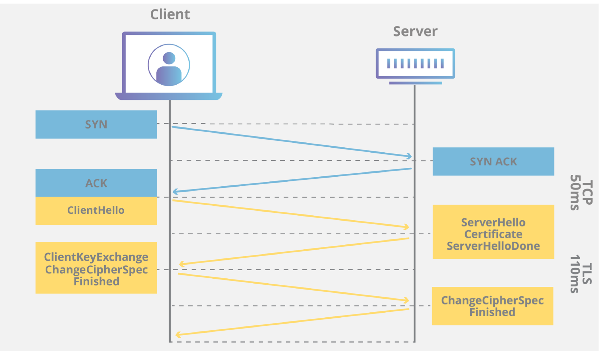

# HTTP vs HTTPS
### 목차
- [HTTP](#http)
- [API](#API)
- [REST(ful) API](#restful-api)
- [HTTP 패킷의 구조](#http-패킷의-구조)
- [개발자 도구로 살펴보기](#개발자-도구로-살펴보기)
- [컴퓨터의 주소](#컴퓨터의-주소)
- [naver.com을 쳤을 때 어떻게 naver 컴퓨터로 접속할까?](#navercom을-쳤을-때-어떻게-naver-컴퓨터로-접속할까)
- [URL의 구조](#url의-구조)
- [PORT NUMBER](#port-number)
- [HTTPS](#https)
- [암호화](#암호화)
- [SSL vs TLS](#ssltls)
- [상태코드](#상태-코드)
- [세션 vs 쿠키 vs 캐시](#세션-vs-쿠키-vs-캐시)
    - [쿠키](#쿠키)
    - [캐시](#캐시)
    - [세션](#세션)

 

## HTTP
- Hypertext Transfer Protocol
- 인터넷에서 정보를 주고 받기 위한 프로토콜 
- Stateless (요청을 한번만 보내기 때문에 계속 연결되어 있는 상태가 아님. 즉 실시간으로 정보가 반영되지 않음)
- 요청의 종류
    - GET
    - POST
    - PUT
    - DELETE
    - PATCH
    - HEAD
    - OPTIONS

 

## API
- Application Programming Interface
- 통신에 대한 모든 인터페이스

 

## REST(ful) API
- REpresentation State Transfer API
- 웹에서 사용하는 인터페이스를 더 효율적으로 만든 API
- 요청의 종류(CRUD)
    - GET(read)
        - 서버에 데이터를 요청하는 데에 사용
    - POST(create)
        - 서버에 데이터를 생성하는 데에 사용
    - PUT(update)
        - 서버에 데이터를 수정하는 데에 사용
    - DELETE(delete)
        - 서버에 데이터를 삭제하는 데에 사용

 

## HTTP 패킷의 구조

1. Header
    - 데이터의 메타 데이터 (쿠키, 세션, 캐시 정보 등)
    - 요청시: Request Header
    - 응답시: Response Header
2. Body

 

## 개발자 도구로 살펴보기

- Request/Response URL: 어떤 URL과 요청을 주고받는지
- Request Method: 어떤 요청 방식인지
- Accept: 어떤 종류의 데이터를 주고 받을것인지
- encoding: 어떤 인코딩 방식인지
- Content-Type: 어떤 데이터 종류/인코딩 타입을(를) 응답받았는지

 

## 컴퓨터의 주소
1. MAC 주소
    - 전 세계에 내 컴퓨터만 딱 하나 갖고 있는 주소
    - 컴퓨터가 만들어진 순간 받음
2. IP 주소
    - 인터넷 상에서 통신을 하기 위해 만들어진 주소

 

## naver.com을 쳤을 때 어떻게 naver 컴퓨터로 접속할까?
1. DNS
    - Domain Name Server
    - URL을 IP 주소로 바꿔주는 서버
    - naver.com -> 223.130.195.95 -> redirect 해줌
2. NS
    - Name Server
    - DNS를 관리하는 서버
    - ex. 가비아, AWS
3. WEB
    - World Wide Web
    - NS를 관리

 

## URL의 구조

- protocol
- host
    - subdomain
        
        
        - ex. https://www.imreadymall.kr / https://dev.imreadymall.kr/
        - 포트를 다른 걸로 연결해놨다고 보면 됨
    - domain
- **port number**
- path
    - 서버 내 리소스 경로
    - 디렉토리 경로와 파일명 포함
- query string
- fragment
    - 리소스 내 특정 부분 지정
    - ex) #section1

 

## Port Number

- 포트 번호: 프로세스(서비스)의 주소 ex. 443
- 포트 넘버 실습
    - 223.130.195.95 입력
        - 브라우저가 기본 포트로 연결 (223.130.195.95:80)
        - 그리고 redirect 223.130.195.95:443
    - 223.130.195.95:80 입력 
        - 223.130.195.95:80으로 접속
        - 그리고 redirect 223.130.195.95:443
    - 223.130.195.95:443 입력
        - 사이트로 연결할 수 없음
        - 443번 포트로 연결했는데 https를 입력하지 않았기 때문
    - 현재 사용하고 있는 포트 확인: sudo lsof -i
- 주요 포트
    - 80: http
    - 443: https
    - 22: ssh
    - 21: ftp
    - 3000: react
    - 3306: mysql
- 포트 번호는 생략가능하며, 생략시 기본 포트가 사용됨

 

## HTTPS
- http를 보안한 것
- 데이터를 암호화 하여 사용함
- 클라이언트와 서버간의 통신은 공개키 암호화 방식으로 암호화되고, 비공개 키로 해독함
    - 공개키: 모두가 알 수 있는 키
    - 비밀키: 나만 알고 있는 키
- SSL vs TLS
    1. SSL (Secure Sockets Layes) 인증서
    2. TLS (Transport Layer Security) 
    인증서, 더 최신 버전임.
    - SSL 을 만든 회사가 빠지면서 더 이상 연관이 없다는 것을 명시하기 위해 이름을 바꿔야 해서 개명한게 TLS고 사실 바꾼건 크게 없음
    - 서버 신원 인증
    - SSL/TLS 인증서를 통해 웹 사이트 검증
    - 웹 사이트 운영하는 쪽에서 인증서를 마련해야 함
    - 데이터 무결성 보장
- 443번 포트 사용

 

## 암호화
- 보통 해시 함수 방식으로 암호화함
- 많이 사용하는 암호화 알고리즘: RSA, SHA256, AES 등 

 

## SSL/TLS

- TCP 3-way-handshaking 후 TLS handshaking 하는 과정이 따로 있음

 

## 상태 코드
- 1XX: 정보성 응답 (접수중 이거나 추가 정보를 달라는 의미)
- **2XX: 성공**
- 3XX: 리다이렉션 (리소스가 새 위치로 변경됨)
- **4XX: 클라이언트 오류**
- **5XX: 서버 오류**

 

## 세션 vs 쿠키 vs 캐시

- 세션: 서버에서 유지되는 상태 정보
- 쿠키: 클라이언트에 저장되는 작은 데이터 조각
- 캐시: 클라이언트에 저장되는 리소스의 사본

 

### 쿠키

- 클라이언트의 웹 브라우저에 저장하는 데이터
- 4KB내 (2000 글자) 데이터 저장 가능
- 저장이 되어 있다가 서버에서 요청 시 줄 수 있음
- 보안에 취약함

 

### 캐시

- 클라이언트에게 웹 리소스를 더 빨리 사용하기 위해 사용
- 이전에 요청한 리소스의 사본을 저장하고, 재요청한 리소스는 서버에 접근하지 않고 사본 응답
- ex. CDN

 

### 세션

- 클라이언트와 서버 간의 상태를 유지하기 위한 메커니즘
- 세션 시작
    - 서버에서 클라이언트에게 고유한 ID 부여
    - 쿠키나 URL을 통해 클라이언트에게 전송 
- 세션 데이터 저장
    - 서버는 세션 ID를 서버 메모리나 데이터베이스에 저장함
- 세션 상태 유지
    - 클라이언트는 요청 시 마다 세션 ID를 서버로 전달
    - 서버는 세션 ID로 클라이언트 식별
- 세션 종료
    - 일정 시간동안 클라이언트와 통신이 없거나 로그아웃하면 세션 종료
    - 서버에서 세션 ID 삭제
    - 세션을 너무 길게 잡으면 보안 위험이 높아짐
- 쿠키보다 보안성이 좋음
